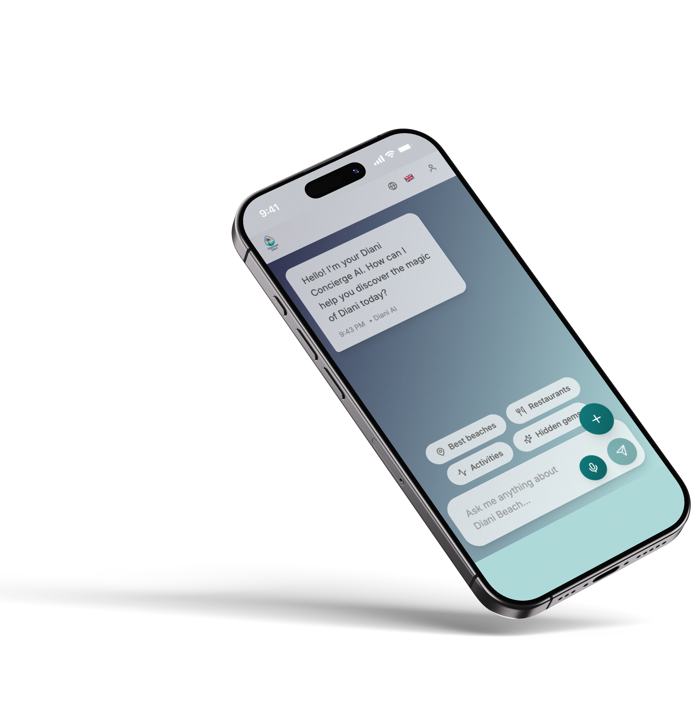

# Discover Diani



Discover Diani is a modern, interactive web application designed to help users explore and experience the best of Diani Beach, Kenya. The platform provides real-time information, personalized recommendations, and a seamless chat concierge to assist visitors and locals in discovering hotels, restaurants, activities, transport options, and more.

---

## Features

- **AI Concierge Chat**: Get instant answers and recommendations via a smart chat interface.
- **Weather Widget**: View up-to-date weather information for Diani Beach.
- **Hotel, Restaurant, Activity & Transport Cards**: Browse curated listings with images, details, and localization support.
- **Interactive Map**: Visualize transport options and points of interest on a map.
- **Localization**: Multi-language support for a global audience.
- **Authentication**: Secure signup, login, and email verification.
- **Responsive Design**: Optimized for mobile and desktop devices.
- **Modern UI**: Built with Tailwind CSS and reusable UI components.
- **Performance**: Fast load times powered by Vite and code-splitting.

---

## Getting Started

### Prerequisites

- [Node.js](https://nodejs.org/) (v18 or higher recommended)
- [npm](https://www.npmjs.com/) or [bun](https://bun.sh/) (optional)
- [Git](https://git-scm.com/)

### Installation

1. **Clone the repository:**
   ```bash
   git clone https://github.com/your-username/discover-diani.git
   cd discover-diani
   ```

2. **Install dependencies:**
   ```bash
   npm install
   # or
   bun install
   ```

3. **Configure environment variables:**
   - Copy `.env.example` to `.env` and fill in the required values (API keys, endpoints, etc.).

4. **Run the development server:**
   ```bash
   npm run dev
   # or
   bun run dev
   ```

5. **Open in your browser:**
   ```
   http://localhost:3000
   ```

---

## Project Structure

```
discover-diani/
├── public/                     # Static assets (images, icons, screenshot)
├── src/
│   ├── components/             # Reusable React components
│   │   ├── cards/              # Card components for hotels, restaurants, etc.
│   │   └── ui/                 # UI primitives (buttons, dialogs, etc.)
│   ├── contexts/               # React context providers
│   ├── hooks/                  # Custom React hooks
│   ├── pages/                  # Page-level components (Landing, Chat, etc.)
│   ├── services/               # API and utility services (chat, auth, weather, translation)
│   ├── types/                  # TypeScript type definitions
│   ├── App.tsx                 # Main app component
│   ├── index.css               # Global styles (Tailwind)
│   └── main.tsx                # App entry point
├── .env                        # Environment variables
├── package.json                # Project metadata and scripts
├── tailwind.config.ts          # Tailwind CSS configuration
├── vite.config.ts              # Vite build configuration
└── README.md                   # Project documentation
```

---

## Usage

- **Chat Concierge**: Start a conversation to get personalized recommendations.
- **Browse Cards**: Explore hotels, restaurants, activities, and transport options.
- **Weather**: Check the current weather in Diani.
- **Map**: View locations and transport routes.
- **Authentication**: Sign up or log in to access personalized features.

---

## Technologies Used

- **React** (TypeScript)
- **Vite** (build tool)
- **Tailwind CSS** (utility-first styling)
- **Context API & Custom Hooks** (state management)
- **OpenAI/AI APIs** (for chat, if configured)
- **Google Maps API** (for maps and transport)
- **Email/Authentication Services** (for user management)
- **ESLint & Prettier** (code quality)

---

## Contributing

Contributions are welcome! To contribute:

1. Fork the repository.
2. Create a new branch: `git checkout -b feature/your-feature`
3. Commit your changes: `git commit -m "Add your feature"`
4. Push to the branch: `git push origin feature/your-feature`
5. Open a pull request.

Please follow the existing code style and include tests where appropriate.

---

## License

This project is licensed under the MIT License. See [LICENSE](LICENSE) for details.

---

## Contact

For questions, feedback, or partnership inquiries, please open an issue or contact the maintainer.

---

_Discover Diani – Your smart guide to the best of Diani Beach!_

